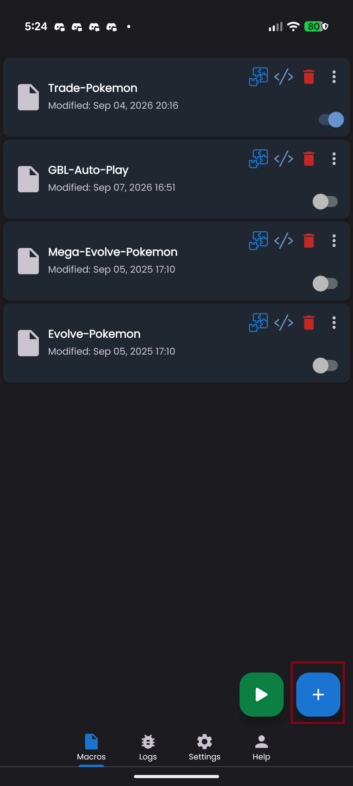
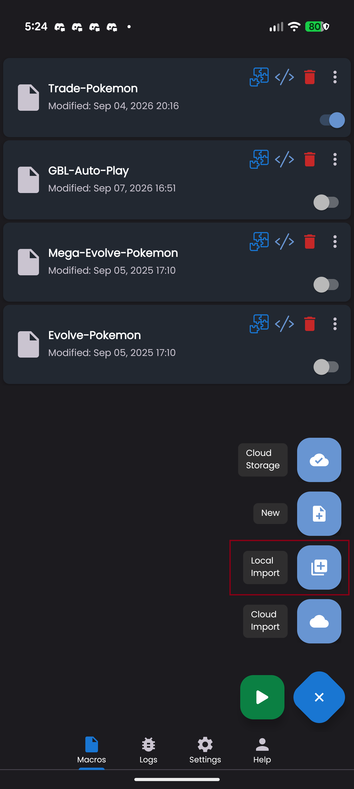
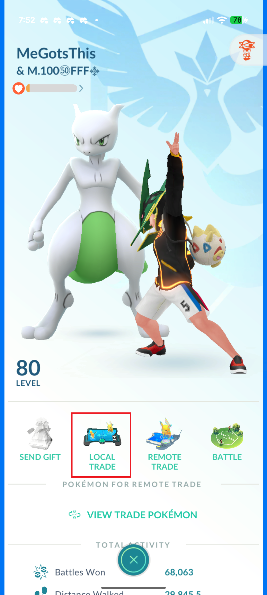
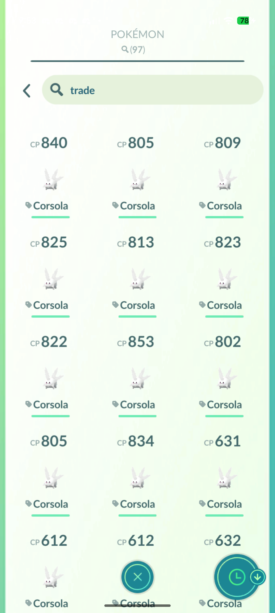
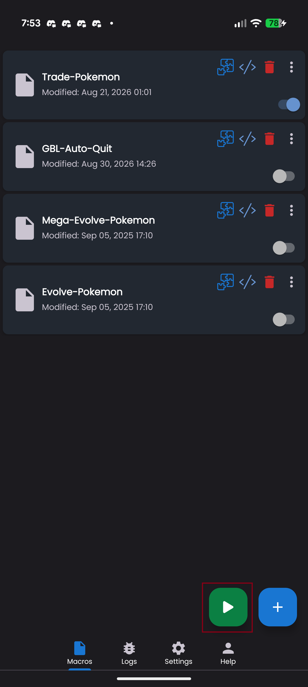
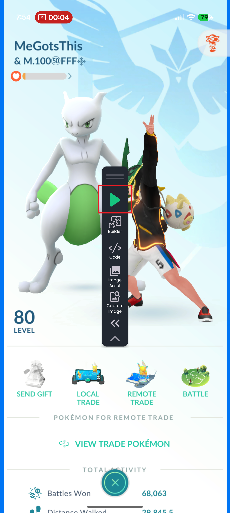
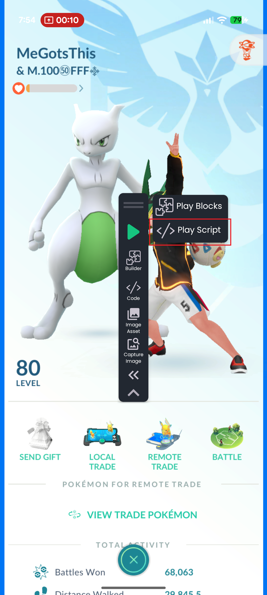
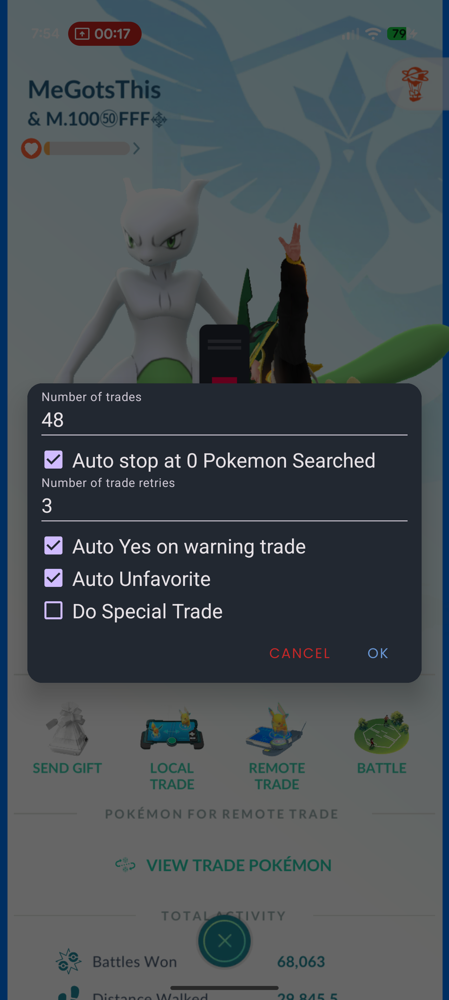

# Trading Pokemon Setup for the Android Macro

This macro automates basic Pokemon GO trades. It searches for a trade button, opens the trade UI, selects a Pokemon, advances through the trade screens, and handles common warning dialogs and trade failures automatically.

[Example Video](#example)

## Why use this over basic auto-tapper?

This trade auto tapper can handle multiple scenarios such as dynamax Pokemon and XXS/XXL Pokemon. This will also run faster than the basic auto-tapper since it does not need to rely on the other device/phone to be in the same screen for timing. The design of the macro is to run as fast as possible. The macro will stop trading automatically when there are no tradable Pokemon left.

## What you need

- [Android Macro](https://androidmacro.com/) installed and working on your devices
- Android Macro Pro purchased
- Pokemon GO installed and logged in and set to English
- Two trainer accounts with at least one Pokemon available to trade

## Compatibility

- Pokemon GO: 0.420.0+
- Android Macro: 1.0.0.36+
- Android Devices:
  - Slab phones (non-foldable)
    - Samsung Galaxy S-series, A-series
    - Pixel series
    - Other phones may be compatible if similar form to above phones
- Android 15+
  - Android 14 and older may need some tweaks, instructions in the future

## Installing/updating the macro

1. [Download](https://github.com/MeGotsThis/android-macro-pokemon-go/releases) the macro
2. Open Android Macro
   
   
3. Click the + button on the bottom right
   
   
4. Select Local Import
5. Select the file
   - For updating, this will replace the existing version.

## In-game setup

Before starting the macro, prepare both devices/phones like this:

1. Open Pokemon GO.
2. Find your trade partner from your friends list.
   
   
3. (Optional/Recommended) Manually complete one trade using the desired Pokemon search string. This helps prepare the search filter for the macro.
   
   
4. Load the macro by pressing the green play button on both devices/phones.
   
   
   - To switch macros, press the toggle button on the right side of the macro.
5. Run the macro with "Play Script".
   - The trade button must be visible on the trainer profile
   
   
   
   
6. Fill in the settings; this only needs to be done once unless you want the settings to be changed. The macro remembers the settings for future runs.
   
   

## Macro settings

When the macro starts, it opens a small dialog with these settings:

- Number of trades
  - Set the maximum number of trades the macro should try.
- Auto stop at 0 Pokemon Searched
  - If enabled, the macro stops when it finds no valid Pokemon to trade.
- Number of trade retries
  - If a trade fails, this controls how many retry attempts it will make before exiting.
- Auto Yes on warning trade
  - Lets the macro accept warning prompts automatically.
  - Typically for Dynamax or Mega evolved Pokemon.
- Auto Unfavorite
  - Automatically removes the favorite mark from Pokemon when needed.
- Do Special Trade
  - Allows the macro to continue through special trade prompts.

Recommended starting values:

- Number of trades: 1 to 100
- Number of trade retries: 2 to 5
- Auto Yes on warning trade: enabled
- Auto Unfavorite: enabled if you want the macro to unmark Pokemon before trading
- Do Special Trade: disabled unless you specifically want special trades

## What the macro handles automatically

This script includes logic for common trade states, including:

- daily trade limit reached
- trade cooldown / out of range
- canceled trades
- temporary trade unavailability
- warning dialogs
- special trade confirmation screens
- auto-stop when zero Pokemon are available
- retry loops for failed trade attempts

## Other Questions

### How long do 100 trades take?

On my two phones, doing 100 trades usually takes under 40 minutes. Pokemon GO has trade cooldown and the macro could (not always) run faster than the cooldown.

### Can this run on tablets or foldable phones?

Most likely not. For tablets, Pokemon GO scales the UI slightly differently compared to slab phones. Personally I don't have foldable phone to test with.
If there is demand for tablet/foldable phones, I can create a new macro with a more general device support but it will run slower. 
Submit a ticket [here](https://github.com/MeGotsThis/android-macro-pokemon-go/issues/new).

### The macro ran into an issue. Where do I submit a bug ticket?

Submit the issue [here](https://github.com/MeGotsThis/android-macro-pokemon-go/issues/new). Please provide what device you are using and some screenshots. I might ask for more screenshots.

### Does this support other languages?

Not yet completely. For the most part, the macro can do the trades fine. Issues may occur when Pokemon GO displays a dialog with text like trade was cancelled. This is the only language dependent part of the macro. Trading mega-evolved/dynamax Pokemon warning dialog is not affected. Submit an [issue](https://github.com/MeGotsThis/android-macro-pokemon-go/issues/new) as a suggestion.

### When sharing screen with Android Macro, do I share one app or whole screen?

This is your choice.

Reasons and side effects for one app:
- You want to see your notifications in full.
- Macro may do phantom taps if you switch to another app.

Reasons for whole screen:
- The macro will likely to accidently press if you switch apps
- Notifications will high sensitive content. [Link](https://www.androidpolice.com/android-15-screen-sharing-protections/)

### Can this run on one phone while the other phone use basic auto tapper?

Yes. The macro does not depend on timing on trades. The intent of the macro is to run as fast as possible so it is almost always faster than the wait time on the basic auto tapper.

### Can this run on one phone while the other phone manually trade?

Yes. The macro does not depend on timing on trades. So you can take as long as you like.

### What settings do you normally use?

48 trades - This is for a few reasons:
- Potentially trade with two different people with about half the trades done each. (49 trades: 1 manually to setup + 48 through the macro)
- There is a break in time to catch my house spawns or berry a gym
- I usually prefer to finish most of my trades before going out, usually after midnight. By not doing all my trades (usually doing 98 from both manual and macro), I can do a special trade any time of the day.
As for the other settings:
- I don't want to think about the warning prompt due to mega-evolved Pokemon or dynamax Pokemon
- Sometimes I forget to unfavorite a Pokemon in the tag
- I don't want the macro to accidentally do my special trade
- Sometimes the tag/search does not have the full 48 Pokemon to trade, so auto stopping helps

## Example

10 trades

https://github.com/user-attachments/assets/baf19623-7160-4aaa-bdc3-d5f953ad8cfa

